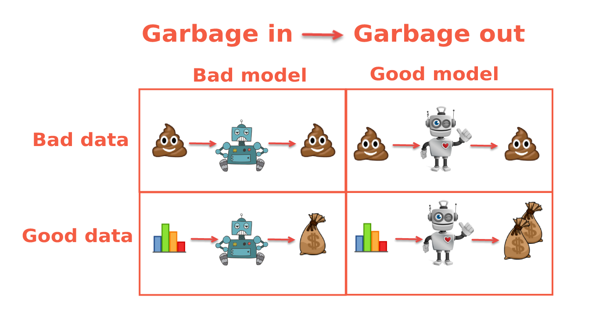
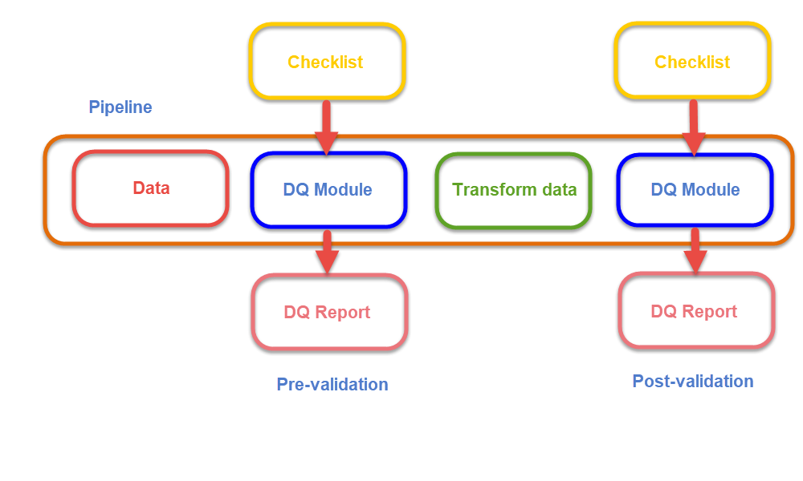

# Качество данных и Spark.

В данном проекте был реализован пакет *data_quality* для оценки и формирования сводного отчета по данным в разных
форматах. По этим отчетам можно судить о качестве данных.

**metric.py** - модуль, содержащий метрики, которые считаются по переданным данным.
Все они обернуты в датаклассы, поддерживается работа с датафреймами pandas и pyspark.

**report.py** - модуль, содержащий класс Report, который отвечает за формирование отчета**

**checklist.py** - модуль приводит пример чек-листа, который будет применяться к данным.

**Data quality (Качество данных)** это практика измерения состояния данных.

Для использования следует выполнить команду:
```bash
pip install -r requirements.txt
```



+ Если на вход аналитического отчета подаются ошибочные, некорректные данные, то и отчет будет ошибочным и иметь ложные выводы.
+ Аналогично с ML моделями - некачественные данные на входе влекут модель которая работает с большими ошибками.

**Data Quality (DQ)**  должен быть встроен в любой пайплайн обработки данных.

# Важные свойства данных

+ **Полнота** - наличие обязательных / необязательных полей, пропуски
+ **Согласованность** - отсутствие в данных расхождений, корректность связей
+ **Доступность** - данные доступны для чтения
+ **Достоверность** - значения однозначны и допустимы

## **Data Quality pipeline**



# **Инструменты для параллельной обработки данных на распределенных системах**

**Hadoop** — это программная платформа с открытым исходным кодом для хранения и обработки больших объемов данных. Она предназначена для параллельной обработки данных распределенных по множеству компьютеров в кластере. Hadoop используется для хранения и обработки больших объемов данных.

**Apache Spark** — это платформа распределенных вычислений с открытым исходным кодом, предназначенная для быстрой и параллельной обработки данных. Платформа построена на основе экосистемы Hadoop и может использоваться для обработки данных, хранящихся в распределенной файловой системе Hadoop (HDFS) или других системах хранения данных.

Spark можно использовать для широкого спектра задач, таких как очистка данных, машинное обучение и обработка данных в реальном времени. Spark известен своей высокой скоростью обработки и простотой использования и стал популярным выбором для многих компаний, работающих с BigData.

**PySpark** — это API Python для Apache Spark. Он позволяет писать скрипты для обработки данных в кластере Spark на языке Python. PySpark часто применяется Data Science командами, поскольку представляет простой и гибкий способ написания пайплайнов обработки данных, как для анализа, так и для обучения моделей.

Сами данные могут могут быть огромного размера и храниться в распределенной файловой системе Hadoop (HDFS) на множестве компьютеров. Обработка данных будет выполняться Spark-кластером. А пайплайны для обработки данных могут быть написаны, например, на языке Python с помощью библиотеки PySpark.

## **Зачем нужен Spark, если есть СУБД?**

---

Зачем нужен Spark, если есть SQL-СУБД (Postgres, ClickHouse и др.)

**Spark** — это распределенная вычислительная платформа, предназначенная для быстрой параллельной обработки данных, в то время как традиционные СУБД (системы управления базами данных) предназначены для хранения и управления данными в структурированном формате. Хотя СУБД можно использовать для некоторых обработки больших данных, но они не всегда хорошо подходят для работы с очень большими объемами или для распределенной обработки данных в режиме реального времени.

**Spark**, с другой стороны, разработан специально для задач распределенной обработки больших массивов данных. Он часто используется в сочетании с традиционными СУБД, что позволяет получить комплексное решение и извлечь плюсы каждого подхода.

Подобный фреймворк нужен чтобы строить определенный data-driven продукт, где ETL-процесс достаточно сложный. Например, он может включать обучение модели, обработку данных перед обучением / перед записью / перед отправкой. И весь процесс необходим выполнять по запросу или по расписанию.

Код на **PySpark** намного более читабелен при росте сложности запроса или алгоритма обработки данных. Благодаря **Spark** добавляются абстракции, которые делают процесс разработки поддержания, корректировки бизнес-логики и взаимодействия с таблицами сильно проще.

# Пример использования PySpark

Приведем простой пример использования **PySpark**. Откроем файл csv, подсчитаем количество строк и выведем топ-10 строк.  PySpark умеет не только подключаться к кластеру Spark и обрабатывать данные там, но и работает с множеством популярных форматов. Что очень удобно для целей отладки скриптов локально, а также для изучения **API PySpark**.

```Python
# Import the PySpark libraries
from pyspark import SparkContext, SparkConf
from pyspark.sql import SparkSession, SQLContext

# Create a SparkSession
spark = SparkSession.builder.appName("MyApp").getOrCreate()

# Create a SQLContext
sqlContext = SQLContext(spark)

# Load a CSV file
df = sqlContext.read.csv("file:///path/to/file.csv", header=True)

# Count the number of rows in the DataFrame
rowCount = df.count()

# Print the row count
print("Number of rows:", rowCount)

# Print the schema of the DataFrame
df.printSchema()

# Show the first 10 rows of the DataFrame
df.show(10)
```

