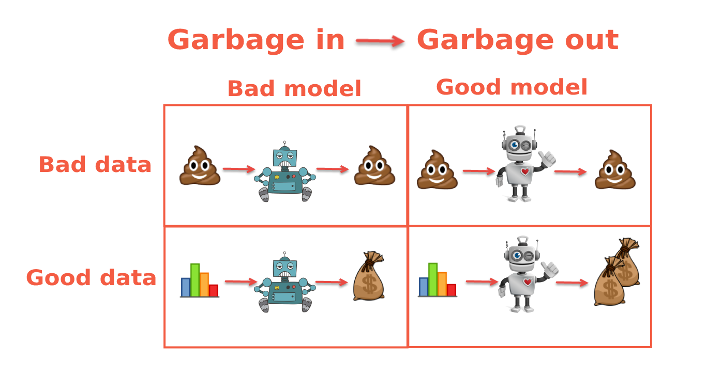
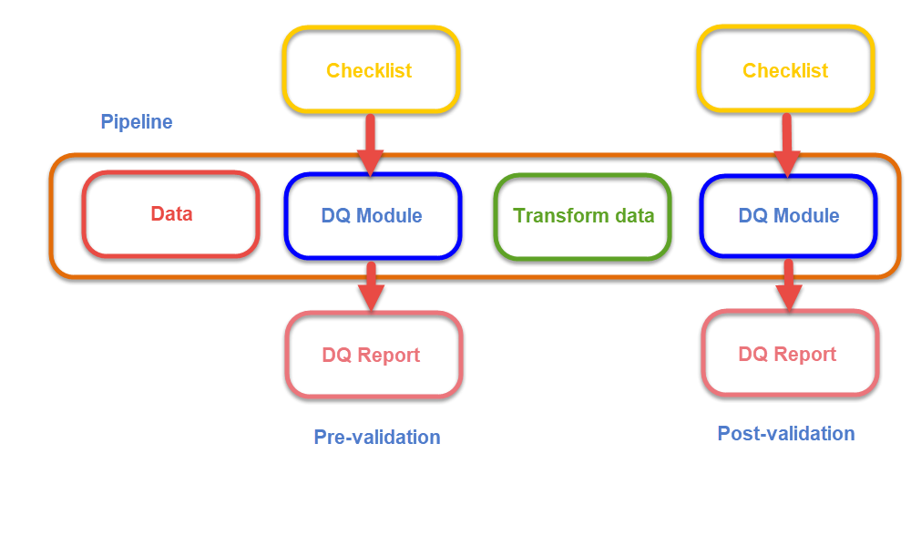

# Data Quality Pipeline

[](https://github.com/Lebedinskiy1377/data_quality_pipeline/actions/workflows/ci.yml)

`data_quality` is a small Python package that measures data quality and builds a summary report.
The same metrics and checklists work on **pandas** and **PySpark** DataFrames and give the same
results (up to floating-point rounding), so you can debug checks locally on a sample and run them
on a Spark cluster in production.

## Why data quality



If an analytical report is built on wrong data, its conclusions are wrong. If an ML model is
trained on wrong data, it makes large errors. Data quality (DQ) checks measure the state of the
data and should be built into every data pipeline.

The main properties of data to check:

- **Completeness**: required fields are present, there are no gaps.
- **Consistency**: there are no contradictions in the data, relations between fields and tables hold.
- **Availability**: the data can be read when it is needed.
- **Validity**: values are unambiguous and within the allowed range.

## DQ in a pipeline



A DQ module runs a checklist against the input data before a transformation (pre-validation) and
against its output after it (post-validation). Every run produces a DQ report.

Production tables are often too large for a single machine and are processed with Spark. Every
metric is computed with Spark aggregations, so the data is never collected to the driver.

## Installation

```bash
git clone https://github.com/Lebedinskiy1377/data_quality_pipeline.git
cd data_quality_pipeline
pip install -e .            # pandas only
pip install -e ".[spark]"   # with PySpark, needs Java 17+
```

Python 3.10+ is required.

## Quick start

```python
import pandas as pd

from data_quality import CountDuplicates, CountNull, CountTotal, Report

checklist = [
    ("sales", CountTotal(), {"total": (1, 1e6)}),
    ("sales", CountNull(["qty"]), {"count": (0, 0)}),
    ("sales", CountDuplicates(["day", "item_id"]), {"count": (0, 0)}),
]

sales = pd.read_csv("examples/data/ke_daily_sales.csv")

report = Report(checklist)
result = report.fit({"sales": sales})
print(report.to_str())
```

```text
DQ Report for tables ['sales']

   table_name  metric                                         limits                     values                                     status  error
0  sales       CountTotal()                                   {'total': (1, 1000000.0)}  {'total': 7}                               .
1  sales       CountNull(columns=['qty'], aggregation='any')  {'count': (0, 0)}          {'total': 7, 'count': 0, 'delta': 0.0}     .
2  sales       CountDuplicates(columns=['day', 'item_id'])    {'count': (0, 0)}          {'total': 7, 'count': 1, 'delta': 0.1429}  F

Passed: 2 (66.67%)
Failed: 1 (33.33%)
Errors: 0 (0.0%)

Total: 3
```

The sample data has a duplicated `(day, item_id)` pair, so the last check fails. In a pipeline,
stop when a check fails or cannot be computed:

```python
if result["failed"] or result["errors"]:
    raise RuntimeError("Data quality checks failed")
```

With PySpark only the tables change:

```python
from pyspark.sql import SparkSession

spark = SparkSession.builder.getOrCreate()
sales = spark.read.csv("examples/data/ke_daily_sales.csv", header=True, inferSchema=True)

result = Report(checklist).fit({"sales": sales})
```

## Checklists and reports

A checklist is a list of `(table_name, metric, limits)` checks:

- `table_name` is a key of the dict of tables passed to `Report.fit()`;
- `metric` is one of the [metrics](#metrics);
- `limits` maps keys of the metric result to inclusive `(low, high)` ranges, for example
  `{"delta": (0, 0.05)}`. Use `{}` to only record the values.

`Report.fit()` runs every check and returns the report, a dict with:

- `title`;
- `result`: a pandas DataFrame with a row per check and the columns `table_name`, `metric`,
  `limits`, `values`, `status` and `error`;
- `passed`, `failed`, `errors`, `total`: the number of checks, and `passed_pct`, `failed_pct`,
  `errors_pct`: the same as percentages.

The status of a check is one of:

| Status | Meaning |
|--------|---------|
| `.`    | Passed: every value is within its limits. |
| `F`    | Failed: a value is outside its limits or missing. |
| `E`    | Error: the check could not be run, e.g. because of an unknown table, column or limit key. The `error` column says why. An error does not stop the other checks. |

`Report.to_str()` formats the report as text.

## Metrics

| Metric | Result | Description |
|--------|--------|-------------|
| `CountTotal()` | `total` | Number of rows. |
| `CountZeros(column)` | `total`, `count`, `delta` | Rows where `column` is 0. |
| `CountNull(columns, aggregation="any")` | `total`, `count`, `delta` | Rows with a missing value (null, NaN) in any (`"any"`) or all (`"all"`) of `columns`. |
| `CountDuplicates(columns)` | `total`, `count`, `delta` | Rows that repeat an earlier row in `columns`. |
| `CountValue(column, value)` | `total`, `count`, `delta` | Rows where `column == value`. |
| `CountBelowValue(column, value, strict=False)` | `total`, `count`, `delta` | Rows where `column <= value` (`<` if `strict`). |
| `CountBelowColumn(column_x, column_y, strict=False)` | `total`, `count`, `delta` | Rows where `column_x <= column_y` (`<` if `strict`). |
| `CountRatioBelow(column_x, column_y, column_z, strict=False)` | `total`, `count`, `delta` | Rows where `column_x / column_y <= column_z` (`<` if `strict`). Rows where `column_y` is 0 are skipped. |
| `CountCB(column, conf=0.95)` | `lcb`, `ucb` | Bounds of the central `conf` share of values: the `(1 - conf) / 2` and `(1 + conf) / 2` quantiles. |
| `CountLag(column, fmt="%Y-%m-%d")` | `today`, `last_day`, `lag` | Days between today and the latest date in `column`: dates, timestamps or ISO 8601 strings like `2022-10-24`. `fmt` formats `today` and `last_day`. |

`count` is the number of matching rows, `total` is the number of rows in the table and
`delta = count / total`. For an empty table `delta` is 0, so use `CountTotal` to catch empty
tables. Rows with missing values never match a comparison. Compare a column with a value of the
same type: pandas and Spark convert mismatched types differently.

Column names are used literally: in Spark, `a.b` is a column named `a.b`, not the field `b` of a
struct column `a`. `CountLag` converts timestamps to dates in the column's time zone in pandas and
in the session time zone (`spark.sql.session.timeZone`) in Spark.

To add a metric, subclass `Metric` as a dataclass and implement `_call_pandas()` and
`_call_pyspark()`.

## Demo

[`examples/demo.py`](examples/demo.py) runs an example checklist against two sample tables:
daily sales and clickstream.

```bash
python examples/demo.py                   # pandas
python examples/demo.py --engine spark    # PySpark
python examples/demo.py --engine both
```

The sample data contains planted problems, and the report catches them:

| Table | Check | Problem |
|-------|-------|---------|
| sales | `CountLag("day")` | The data is from October 2022. |
| sales | `CountDuplicates(["day", "item_id"])` | Item 100 appears twice on 2022-10-24. |
| sales | `CountRatioBelow("revenue", "price", "qty", strict=True)` | Revenue 500 is less than price × qty = 120 × 5. |
| relevance | `CountLag("day")` | The data is from September 2022. |
| relevance | `CountBelowColumn("clicks", "payments", strict=True)` | Item 300 has 2 payments and 0 clicks on 2022-09-23. |

## Development

```bash
pip install -e ".[spark,dev]"
pytest              # Spark tests are skipped if PySpark or Java is not available
ruff check .
ruff format .
```

Every metric is tested on both pandas and PySpark. CI runs the linters and the tests on
Python 3.10 with the oldest supported pandas and PySpark, on Python 3.13 with the latest
releases, and without PySpark.

## Project structure

```text
├── src/data_quality/
│   ├── metrics.py     # metrics
│   └── report.py      # Report: runs a checklist and formats the results
├── examples/
│   ├── demo.py        # example checklist
│   └── data/          # sample tables
├── tests/
└── docs/images/
```
